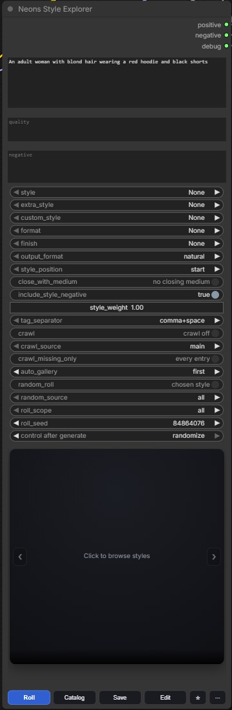
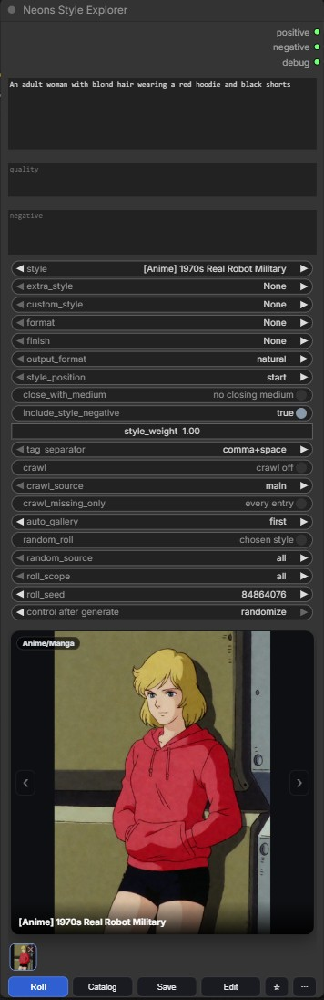
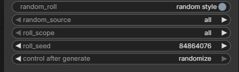
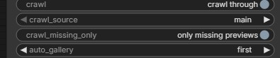
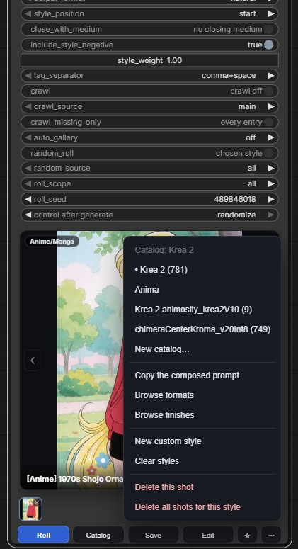
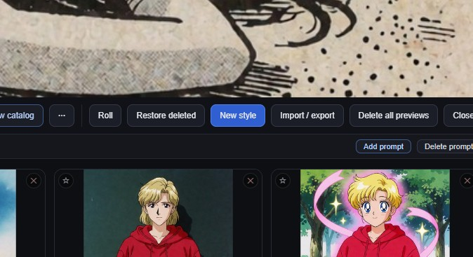
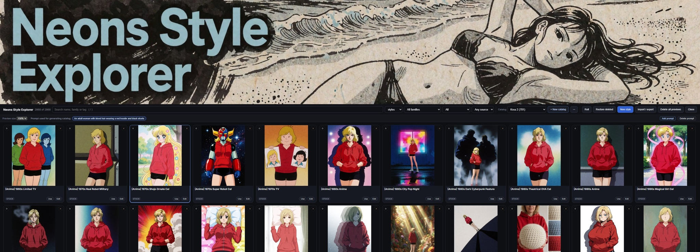

# Quick start

**Neons Style Explorer** puts a style prefix in front of your prompt. You write
what is in the picture; the style says how it is rendered — and closes with its
medium, so an anime style ends `anime style image` and a photographic one ends
`photograph style image`.

Five minutes, six steps. Nothing here needs a setting you have not met yet.

| | |
|---|---|
| [1. Your prompt only](#1-your-prompt-only) | [4. Filling the gallery](#4-filling-the-gallery) |
| [2. Choosing a style](#2-choosing-a-style) | [5. Custom styles](#5-custom-styles) |
| [3. A random style each run](#3-a-random-style-each-run) | [6. Where to go next](#6-where-to-go-next) |

---

## 1. Your prompt only

Drop the node in, wire **positive** and **negative** into your sampler, and type
your prompt. With every style slot on `None` and `random_roll` off, the node
passes your prompt through untouched — it is safe to leave in a workflow you are
not styling.

**Set it like this**

| Widget | Value |
|---|---|
| `style`, `extra_style`, `custom_style` | None |
| `random_roll` | chosen style |
| `crawl` | crawl off |

The three text boxes are **prompt**, **quality** and **negative**. Quality sits
at the very front of the composed prompt (`masterpiece, best quality…`), so it
stays out of the way of the style.

The panel reads **Click to browse styles** until a style is chosen — click it,
or press **Catalog**, to open the browser.

 

---

## 2. Choosing a style

There are three style slots and **only one is ever active** — choosing in one
sets the others to None, so you always know what is being composed.

| Slot | What is in it |
|---|---|
| `style` | the written catalog — 1,271 hand-written entries |
| `extra_style` | the imported `[Extra]` pack — 1,596 entries |
| `custom_style` | styles you wrote yourself |

Pick from the dropdown, or press **Catalog** and click a card. The panel then
shows the style's name, its family, and its preview once you have saved one.

**`style_position`** decides whether the style clause goes in front of your
prompt or after it. Worth experimenting with: in front is usually stronger, and
behind lets your subject lead.

Two switches next to it are worth knowing early:

* **`close_with_medium`** — keeps or drops the closing phrase
  (`… oil painting style image`). Leave it on unless your checkpoint reads it as
  a subject rather than a look.
* **`style_weight`** — 1.00 is neutral. Higher wraps the clause as
  `(clause:1.50)` for a harder push.

 

---

## 3. A random style each run

Turn **`random_roll`** to *random style* and every run rolls a different one.

| Widget | Value |
|---|---|
| `random_roll` | random style |
| `random_source` | all · main · extra · custom |
| `roll_scope` | all · family · favourites · recent · by preview state |
| `roll_seed` | set `control after generate` to **randomize** |
| `crawl` | must be **off** |

**`random_source`** is the pool it draws from; **`roll_scope`** narrows it
further. "favourites" plus randomize is a good way to shuffle a shortlist you
trust.

Crawl overrides the dice while it is on, so leave `crawl` off here.

 

---

## 4. Filling the gallery

The gallery ships empty — the previews you see are the ones you make. **Crawl**
walks the style list one entry per queued run, so a batch fills it in order.

| Widget | Value | Why |
|---|---|---|
| `crawl` | crawl through | steps to the next style on every queued run |
| `crawl_source` | main · extra · custom | which list it walks |
| `crawl_missing_only` | only missing previews | skips styles that already have one |
| `auto_gallery` | first — or every | saves the result against the style automatically |

`first` keeps one preview per style. `every` saves each run, and you pick the
cover later from the strip under the preview.

Queue as many runs as you want previews and leave it: crawl starts from the
style you are parked on and visits every entry once.

> **Name your catalog after your checkpoint.** Previews are kept per catalog, so
> a style looks different under each model you use. In the browser, press
> **New catalog** and name it for the checkpoint — your galleries stay
> organised instead of mixing models together.

---

## 5. Custom styles

Write your own from either end:

* the **⋯** menu at the bottom right of the node → **New custom style**
* the browser's **New style** button

Editing works the same way: **Edit** at the bottom of the node edits the style
you are on, and every card in the browser carries its own **Edit**.

A custom style takes a name, a family, the clause, its medium and its tags.
Rename it whenever you like — the old name keeps working as an alias and its
previews stay attached, because previews are filed under a permanent id rather
than the name.

Shipped styles can be edited too. That writes a local override, shown as
**✎ Edited** in the browser's family filter, and **Revert** puts the original
back.

 

The browser's toolbar: catalogs, **Roll**, **Restore deleted**, **New style**,
**Import / export**, and per-card **✕** to delete a preview or **★** to
favourite it.

---

## 6. Where to go next

The browser searches names, families, aliases and booru tags; filters by axis,
family, source and preview state; and remembers how you left it.

* **[The manual](MANUAL.md)** — every widget, the crawl workflow, catalogs,
  favourites, writing styles, import and export, and troubleshooting.
* **[STYLES.md](STYLES.md)** — all 3,015 entries with their clauses.
* **Restart ComfyUI after updating.** A browser refresh loads the new interface
  but not the node's HTTP routes; if the browser shows a red strip saying it is
  using the bundled snapshot, that is what has happened.
