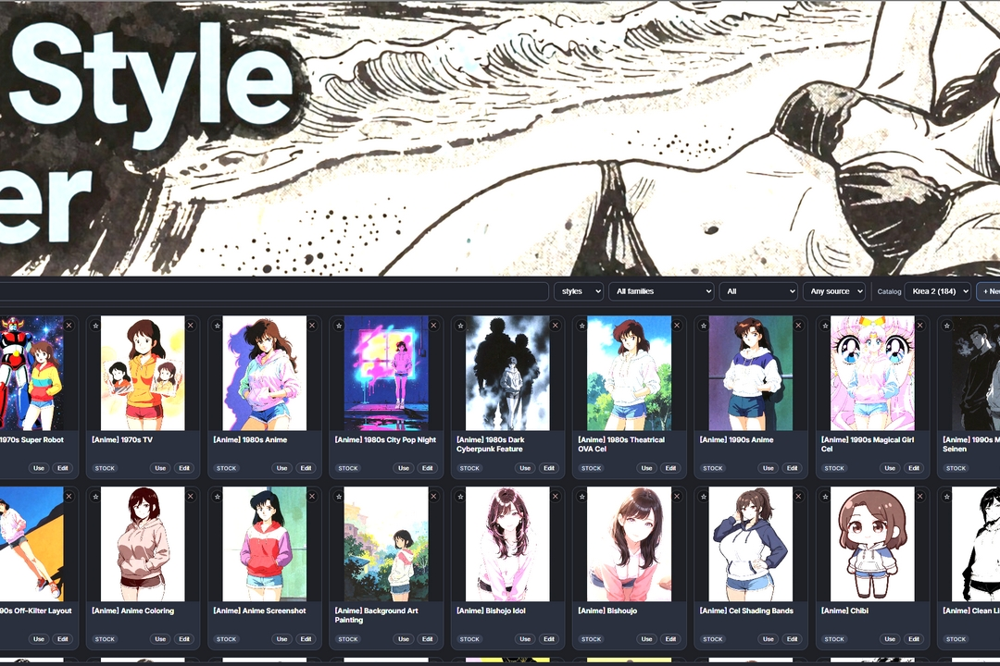
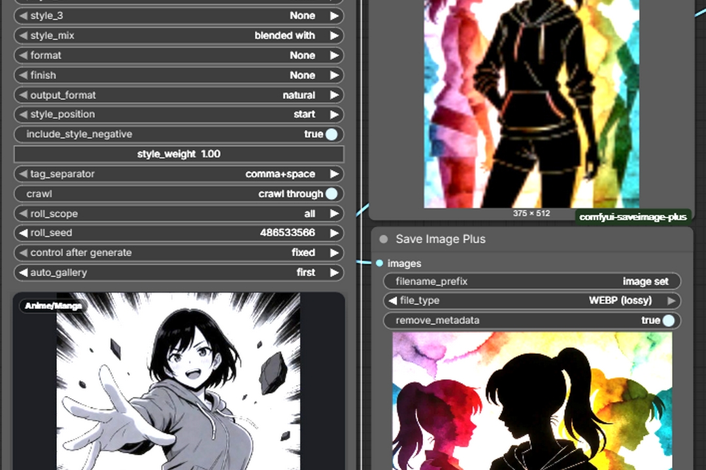
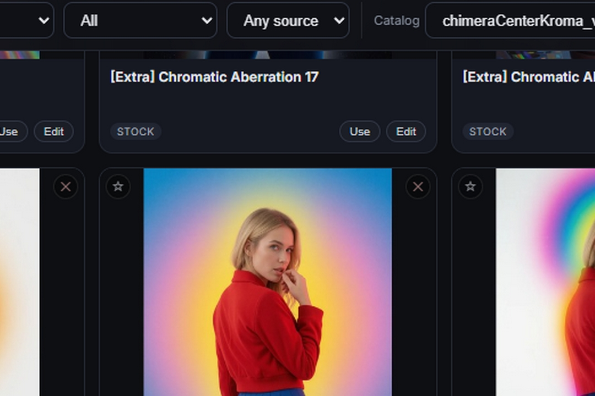
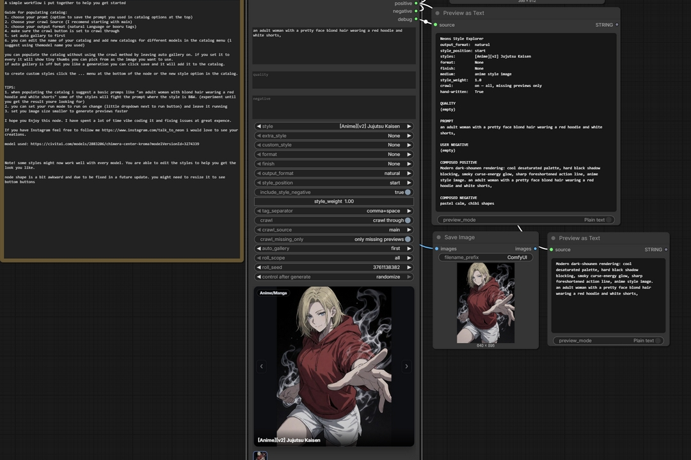

# Neons Style Explorer

A style catalog node for ComfyUI. A style entry is a **style prefix** and nothing
else: it describes how the picture is rendered and closes with the medium —
`... anime style image`, `... photograph style image`, `... cgi style image`.
No instructions to the model, no sentences about what the image contains.

Nodes (category **Neons**):

* **Neons Style Explorer** — text in, text out
* **Neons Style Explorer (Encode)** — the same plus CLIP encode
* **Neons LoRA Explorer** — a LoRA loader with a preview gallery per model folder
* **Neons Gallery Capture** — headless equivalent of the Save button

**[Read the manual](MANUAL.md)** · [pre-release audit](AUDIT.md) — every widget, the browser, previews, the
crawl workflow, catalogs and troubleshooting.

## What it looks like

| | |
|---|---|
|  |  |
| The browser: search, filter by family, source or preview state, click a card to load it. | The node in a graph, showing the style it composed with and its preview. |
|  |  |
| Every card carries Use and Edit, and its own preview once you have saved one. | The whole chain: node, composed positive and negative, and the saved result. |

## Install

**ComfyUI Manager** — search for *Neons Style Explorer* and install, then restart
ComfyUI.

**Manually** — clone into `ComfyUI/custom_nodes/` and restart:

```bash
cd ComfyUI/custom_nodes
git clone https://github.com/Neon-Sparks/ComfyUI-NeonsStyleExplorer
```

Restart ComfyUI after installing or updating — a browser refresh loads the new
interface but not the node's HTTP routes, so new features fail until the process
restarts.

No extra dependencies: it uses Pillow and numpy, both of which ComfyUI already
ships. Python 3.9+.

## Output

```
masterpiece, best quality, Anime broadcast still, flat cel colouring in hard
shadow bands, simplified on-model faces, painted matte background, mild
compression softness and grain, TV-frame colour, anime style image, a woman on
a fire escape at night
```

```
masterpiece, best quality, (anime_screenshot:1.1), (anime_coloring:1.1),
(cel_shading:1.1), (film_grain:1.1), 1girl, rooftop
```

* `output_format` — natural | danbooru | natural + danbooru
* `style_weight` — a 1.0–5.0 slider; wraps the clause as `(clause:weight)` in natural mode and every style tag as `(tag:weight)` in booru modes
* `style_position` — put the style clause at the **start** or the **end**
* `quality` — a separate quality-prefix box, always kept at the very front
* three axes — `style`, `format` (what job the frame does), `finish` (a
  stackable realism qualifier)
* `🎲 Random` at the top of every style dropdown, with `roll_scope`
  (all / family / favourites / recent / has preview / missing preview) and
  `roll_seed` plus its control-after-generate widget (set it to randomize so
  every run rolls anew)
* **Named catalogs** — keep a separate preview set per model ("my Krea 2", "SDXL",
  a client project): each catalog has its own gallery, favourites and recents,
  while the style texts and your edits stay shared. Pick one from the toolbar,
  add one with **+ New catalog**
* **Crawl through** — a switch that walks the main style dropdown one entry per
  queued run instead of rolling, starting from the style you have selected, over
  whatever `roll_scope` selects; set
  `roll_scope` to *missing preview*, `auto_gallery` to *every*, queue a few
  hundred runs and the gallery fills itself in order
* **Favourites and recents** — star entries from the card or the node toolbar,
  filter the browser by them, and let the dice roll inside either list; every
  run records the style it used

## The panel

The preview scales with the node on both axes, the button row sits under it, and
the panel body is click-through so the node still drags from anywhere. Buttons:
**Roll**, **Catalog**, **Save**, **Edit**, and a `⋯` menu (browse formats and
finishes, roll style 2/3, new custom style, clear, delete shots). The composed
prompt updates live underneath.

## Random

`random_roll` rolls a style each run; `random_source` picks the pool — all,
main, extra or custom — and `roll_scope` narrows it (family, favourites,
recent, by preview state). The old `🎲 Random` entry in the dropdowns is gone;
a workflow that used it switches over on load.

## Catalog browser

Banner at the top that scrolls away under a sticky toolbar, then a virtualised
grid — only the visible cards are mounted, so a thousand entries scroll
smoothly. Search over name, alias, family and tags; filter by axis, family,
source and preview state; hover shows the clause; Edit opens the entry; JSON
import/export for style packs.

## Gallery

The gallery ships empty — nothing is bundled. Generate, then press **Save**: the last result becomes that style's preview.
Up to eight shots per style, click a thumbnail in the strip to make it the
cover, `auto_gallery` can fill them automatically. Previews are keyed on the
style's stable id, so renaming never orphans an image.

## LoRA node

**Neons LoRA Explorer** loads a LoRA and keeps a preview gallery beside it. The
list is ComfyUI's own `loras` folder, and the folders do the filing: a
top-level folder is a **gallery**, a folder inside it is a **family**, and loose
files land in **Unsorted**. No configuration.

```
loras/krea 2/film_grain.safetensors            gallery "krea 2"
loras/krea 2/portraits/soft_light.safetensors  gallery "krea 2", family "portraits"
loras/loose_one.safetensors                    gallery "Unsorted"
```

Each gallery keeps its own previews, so the same LoRA filed under two checkpoint
folders has two separate sets of images — you can see how it behaves on each
model instead of one mixed pile.

* **Gallery** opens the browser: search, filter by gallery, family, favourites
  or preview state, click a card to load that LoRA. **✕** on a card deletes its
  previews, **★** favourites it, **Rescan** re-reads the folder after you add
  LoRAs without restarting. The browser reopens on the search, filters and
  scroll position you left it on.
* **Trigger words** are edited under the preview and shown on every card. They
  come out of the node's **triggers** output, so the words travel with the LoRA
  straight into your prompt.
* **Save** files the newest generated image against the current LoRA. Saving is
  manual — no crawl, no auto-populate.
* Outputs: `model`, `clip`, `lora_name`, `triggers`.

Previews live in `user/loras/<gallery>/` and trigger words in
`user/loras/triggers.json`. Nothing is ever written to your loras folder.

## The catalog

**3015 entries** — 1419 with every clause hand-written for this catalog, plus the 1596-entry imported **Extra** family, across nine families: photography & film 249, traditional painting 208, anime & manga 164, design & aesthetics 150, 3D & games 148, illustration 122, comics & print 83, experimental & material 79, western animation 68. Three axes — 2867 styles, 97 formats, 51 finishes. The Extra family is imported from ThetaCursed's Krea 2 style collection under its MIT licence; see `THIRD-PARTY-NOTICES.md`. Old `[Clio]` names are relabelled `[v2]`, and every merged duplicate keeps its old name as a search alias. `STYLES.md` lists everything.

```
tools/build_all.sh               # import + lint + index + docs + examples + tests
python3 tools/lint.py --all      # every finding
node tools/check_web.mjs         # UI: undefined calls and bad imports
python3 tests/test_compose.py    # 57 tests
```

The source of truth for the text is `tools/written/*.json`; `import_source.py`
merges it into `styles/`. The linter enforces the wording rules: the clause must
close with its medium, must not contain instruction or scope language, must not
name picture content, ≤380 characters, and every tag must exist in
`data/tags.txt`.

## Layout

```
catalog.py    loading, merging, caching, lookup, roll
catalogs.py   named catalogs, each with its own previews and favourites
compose.py    the one composer (the UI calls it over HTTP)
nodes.py      the nodes
gallery.py    preview gallery on disk
runs.py       per-prompt records, so a saved image gets the right style
loras.py      LoRA folders, previews, favourites, trigger words
bundle.py     catalog export / import as a zip
store.py      overrides / custom / hidden styles
styles/       the catalog, one file per family
data/tags.txt validated booru tag vocabulary
web/          api, css, panel, catalog_ui, lora, main
tools/        import, lint, harnesses, and the source in tools/written/
```

MIT licensed.
